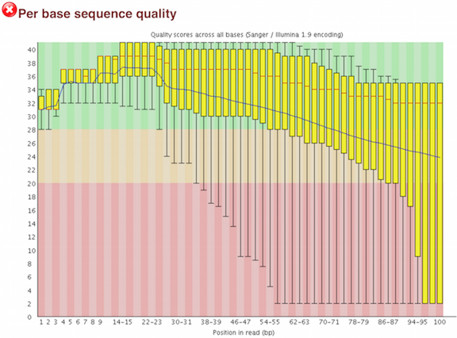
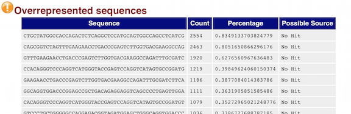

## IMPORTANT: the paths to files and directories in this workshop are only examples. You will need use your own so please try not to copy and paste the commands but write them yourself matching the correct locations on your computer

## Learning Objectives:

* Understand the experiment and its objectives
* Learn how to evaluate the quality of your NGS data using the program FastQC
* Learning best practices for NGS analysis


## Understanding the dataset
The sequence data that you will be analysing is from a 3-year-old male who presented with difficulty walking after the first year of life, followed by signs of muscle wasting and weakness, muscle rigidity, developmental delays, progressive loss of vision leading to blindness, convulsions, impaired swallowing, paralysis, and dementia. An MRI scan showed a “tigroid” or “leopard-skin” appearance within the deep white matter - recognizable abnormalities of white matter. Further clinical tests suggest a diagnosis of Metachromatic leukodystrophy (MLD, also called Arylsulfatase A deficiency): is a lysosomal storage disease which is commonly listed in the family of leukodystrophies as well as among the sphingolipidoses as it affects the metabolism of sphingolipids.

The patient’s exome was sequenced using the paired-end method on an Illumina HiSeq 2500 following target enrichment using the Nextera Rapid Capture Exome and Expanded Exome kit.

This data is simulated - but it does represents a real life scenario


## Quality Control of FASTQ files

A critical first step in the analysis of your NGS data is assessing the quality of your data and performing any necessary quality control measures, such as trimming.


## FastQC
Since we have our directory structure set up, and we know about what information is stored in a FASTQ file, the next step is to examine quality metrics for our data.

FastQC (http://www.bioinformatics.babraham.ac.uk/projects/fastqc/) provides a simple way to do some quality control checks on raw sequence data coming from high throughput sequencing pipelines. It provides a modular set of analyses which you can use to give a quick impression of whether your data has any problems of which you should be aware before doing any further analysis.

The main functions of FastQC are:

* Import of data from BAM, SAM or FastQ files (any variant)
* Providing a quick overview to tell you in which areas there may be problems
* Summary graphs and tables to quickly assess your data
* Export of results to an HTML based permanent report
* Offline operation to allow automated generation of reports without running the interactive application

### Run FastQC  

Change directories to `untrimmed_fastq`.

`$ cd ~/ngs_course/dnaseq/data/untrimmed_fastq`  


FastQC will accept multiple file names as input, so we can use the `*.fq` wildcard.

`$ fastqc *.fq`

*Did you notice how each file was processed serially? How do we speed this up?*

Let's use the multi-threading functionality of FastQC to run 4 jobs at once (your OpenStack virtual machine has 4 cpus).

```

$ cd ~/ngs_course/dnaseq/data/untrimmed_fastq

$ fastqc -t 4 *.fq  #note the extra parameter we specified for 4 threads
```

How did I know about the -t argument for FastQC?

`$ fastqc --help`


Now, let's create a home for our results

`$ mkdir ~/ngs_course/dnaseq/results/fastqc_untrimmed_reads`

...and move them there (recall, we are still in `~/ngs_course/dnaseq/data/untrimmed_fastq/`)

```
$ mv *fastqc* ~/ngs_course/dnaseq/results/fastqc_untrimmed_reads/
```

### Results
   
Let's take a closer look at the files generated by FastQC:
   
`$ ls -lh ~/ngs_course/dnaseq/results/fastqc_untrimmed_reads/`

#### HTML reports
The .html files contain the final reports generated by fastqc, let's take a closer look at them. Transfer the html files over to your personal computer via *FileZilla*.

##### Filezilla - Step 1

Open *FileZilla*, and click on the File tab. Choose 'Site Manager'.
 


##### Filezilla - Step 2

Within the 'Site Manager' window, do the following: 

1. Click on 'New Site'
2. Host: THE_INSTANCE_IP 
3. Protocol: SFTP - SSH File Transfer Protocol
4. Logon Type: Key file
5. User: ubuntu
6. Key file: PATH_TO_THE_KEY_FILE
7. Click 'Connect'
8. Filezilla will ask you to convert the key file into a compatible format, sey yes and use the new generate key file
	
	
***FastQC is just an indicator of what's going on with your data, don't take the "PASS"es and "FAIL"s too seriously.***

FastQC has a really well documented [manual page](http://www.bioinformatics.babraham.ac.uk/projects/fastqc/) with [more details](http://www.bioinformatics.babraham.ac.uk/projects/fastqc/Help/) about all the plots in the report. We recommend looking at [this post](http://bioinfo-core.org/index.php/9th_Discussion-28_October_2010) for more information on what bad plots look like and what they mean for your data.

Below are two of the most important analysis modules in FastQC, the **"Per base sequence quality"** plot and the **"Overrepresented sequences"** table. 

The **"Per base sequence quality"** plot provides the distribution of quality scores across all bases at each position in the reads.



The **"Overrepresented sequences"** table displays the sequences (at least 20 bp) that occur in more than 0.1% of the total number of sequences. This table aids in identifying contamination, such as vector or adapter sequences. 



We will go over the remaining plots in class. Remember, our report only represents a subset of reads (chromosome 1) for `Mov10_oe_1.subset.fq`, which can skew the QC results. We encourage you to look at the [full set of reads](https://dl.dropboxusercontent.com/u/74036176/Mov10oe_1-fastqc_report.html) and note how the QC results differ when using the entire dataset.

#### .zip files   

Let's go back to the terminal now. The other output of FastQC is a .zip file. These .zip files need to be unpacked with the `unzip` program. If we try to `unzip` them all at once:

```
$ cd ~/ngs_course/dnaseq/results/fastqc_untrimmed_reads/    
$ unzip *.zip
```

Did it work? 

No, because `unzip` expects to get only one zip file. Welcome to the real world.
We *could* do each file, one by one, but what if we have 500 files? There is a smarter way.
We can save time by using a simple shell `for loop` to iterate through the list of files in *.zip.

After you type the first line, you will get a special '>' prompt to type next lines.  
You start with 'do', then enter your commands, then end with 'done' to execute the loop.

Note that in the first line, we create a variable named `zip`.  After that, we call that variable with the syntax `$zip`. `$zip` is assigned the value of each item (file) in the list *.zip, once for each iteration of the loop.

This loop is basically a simple program. When it runs

```
$ for zip in *.zip
> do
> unzip $zip
> done
```
it will run unzip once for each file (whose name is stored in the $zip variable). The contents of each file will be unpacked into a separate directory by the unzip program.

The 'for loop' is interpreted as a multipart command.  If you press the up arrow on your keyboard to recall the command, it will be shown like so:

    for zip in *.zip; do unzip $zip; done

When you check your history later, it will help you remember what you did!

##### Document your work

What information is contained in the unzipped folder?

```
$ ls -lh SOME_FILE_fastqc
$ head SOME_FILE_fastqc/summary.txt
```

To save a record, let's `cat` all `fastqc summary.txt` files into one `full_report.txt` and move this to `~/ngs_course/dnaseq/docs`. 
You can use wildcards in paths as well as file names.  Do you remember how we said `cat` is really meant for concatenating text files?
    
`$ cat */summary.txt > ~/ngs_course/dnaseq/logs/fastqc_summaries.txt`


## Best practices for NGS Analysis 

Ok so now you are all set up and have begun your analysis. You have set up your space in a way such that someone unfamiliar with your project should be able to look at your computer files and understand in detail what you did and why. Now before we move on, we have a few words of wisdom to impart upon you:

1. **Make sure to use the appropriate software.** Do your research and find out what is best for the data you are working with. Don't just work with tools that you are able to easily install. Also, make sure you are using the most up-to-date versions! If you run out-of-date software, you are probably introducing errors into your workflow; and you may be missing out on more accurate methods.

2. **Keep up with the literature.** Bioinformatics is a fast-moving field and it's always good to stay in the know about recent developments. This will help you determine what is appropriate and what is not.  

3. **Do not re-invent the wheel.** If you run into problems, more often than not someone has already encountered that same problem. A solution is either already available or someone is working on it -- so find it!

4. **Testing is essential.** If you are using a tool for the first time, test it out on a single sample or a subset of the data before running your entire dataset through. This will allow you to debug quicker and give you a chance to also get a feel for the tool and the different parameters.


### Naming files

A few months from now, you may not remember what you were up to when you created a particular set of files. 
Sensible file names will make your analysis traversable by you and your collaborators, and writing the methods section for your next paper will be a breeze. Below is a short list of things we suggest when it comes to file naming:

1. **Keep sample names short and meaningful.** If required, include some form of a long explanation for the sample names (i.e comment lines at the top of the metadata file, or add it in your README file).
2. Have **unique sample names** and try to avoid names that look like dates (Dec14), times (AM1245) and other things that Excel might auto-convert. 
3. **Remove spaces and punctuation.** When working on the command line, spaces in file names make everything exponentially more difficult. Replace all your spaces with under_scores and avoid the use of any special characters.


---
*This lesson has been developed by members of the teaching team at the [Harvard Chan Bioinformatics Core (HBC)](http://bioinformatics.sph.harvard.edu/). These are open access materials distributed under the terms of the [Creative Commons Attribution license](https://creativecommons.org/licenses/by/4.0/) (CC BY 4.0), which permits unrestricted use, distribution, and reproduction in any medium, provided the original author and source are credited.*

* *The materials used in this lesson was derived from work that is Copyright © Data Carpentry (http://datacarpentry.org/). 
All Data Carpentry instructional material is made available under the [Creative Commons Attribution license](https://creativecommons.org/licenses/by/4.0/) (CC BY 4.0).*
