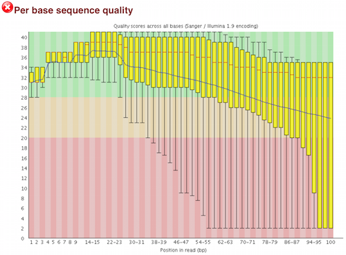

## Learning Objectives:
* Explore trimming strategies for improving the quality of FASTQ reads
* Use a `for loop` to automate operations on multiple files

##Quality Control - Trimming

So far we have run our raw reads through FastQC to assess the quality of our sequencing reads. Now we are going to improve the quality of our reads, by **trimming** off any "bad" bases.


Remember, that for our raw fastq data, we found the quality of the bases decreasing towards the 3' ends of the reads:



Raw sequencing reads can exhibit this decreasing sequence quality at the 3' ends; it used to be more common and more dramatic, but the Illumina set up has gotten better with time. We can improve the overall quality of our data by trimming off the poor quality bases; in addition, we can also trim off any contaminating vector or adapter sequences from the reads. 

> **Why Trim?**: Sequencing reads containing poor quality bases or contaminating sequences won't match the reference genome or transcriptome as well, making it difficult to align them to the known sequences.

## Trimming Tools  

Quality trimming can be accomplished either by removing the bases entirely from the sequence using a trimming tool or by an alignment tool that *"soft clips"* the low quality bases. Soft clipping doesn't actually remove the sequence, but the clipped sequence is skipped over or ignored when performing downstream operations. Although many alignment tools can perform the soft clipping of low quality bases, they **cannot** remove adapter or vector sequences. Therefore, if you use soft clipping and have a known issue with adapter or contamination, it is still recommended that you use a tool that removes these sequences from your reads prior to alignment.

Many trimming tools have been developed to perform quality and adapter trimming, but there are various strategies employed, and the tool or strategy chosen often relates to the personal preference of the user and the downstream tools to be used.

Trimming tools can perform sequence trimming using the following strategies:

**Quality trimming methods:**

- **base-by-base:** remove individual bases if it is below a certain quality threshold
- **sliding window approach:**
	- remove all bases of the window and 3' of the window if the average quality across a window size (e.g. 5 bases) is below a specific quality threshold
	-  remove all bases of the window and 3' of the window if a specific percentage of bases in window is below a specific quality threshold (e.g. remove bases if % good quality bases in window ≤ 70%)
- **hard crop:** remove a certain number of bases from the ends of all reads (e.g. remove 12 bases from all reads at 5’ end)
- **read removal:** if % good quality bases in whole read is below a specific threshold discard read (e.g. discard read if % good quality bases ≤ 70%)

**Other trimming options:**

- **adapter trimming:** trim any left over adapter sequences (usually at 5’ end for SE)
- **minimum length removal:** remove read if the read length is below a certain threshold


## Trimmomatic

We will use [*Trimmomatic*](http://www.usadellab.org/cms/?page=trimmomatic) to trim away adapters and filter out poor quality score reads. *Trimmomatic* is a java based program that can remove sequencer specific reads and nucleotides that fall below a certain threshold. *Trimmomatic* offers the option to trim reads using a hard crop, sliding window or base-by-base methods. It can also trim adapter sequences and remove reads if below a minimum length. In addition, *Trimmomatic* can be multi-threaded to run quickly using a single, complex command. 


 *Trimmomatic* is java based. The following are its usage instructions:

```
trimmomatic 
Usage: 
       PE [-version] [-threads <threads>] [-phred33|-phred64] [-trimlog <trimLogFile>] [-summary <statsSummaryFile>] [-quiet] [-validatePairs] [-basein <inputBase> | <inputFile1> <inputFile2>] [-baseout <outputBase> | <outputFile1P> <outputFile1U> <outputFile2P> <outputFile2U>] <trimmer1>...
   or: 
       SE [-version] [-threads <threads>] [-phred33|-phred64] [-trimlog <trimLogFile>] [-summary <statsSummaryFile>] [-quiet] <inputFile> <outputFile> <trimmer1>...
   or: 
       -version
```

The `PE` argument is a keyword that specifies we are working with paired-end reads. We have to specify the `-threads` parameter because *Trimmomatic* uses all threads on a node by default.

The next two arguments are input file and output file names. These are then followed by a series of options. The options tell the *Trimmomatic* program exactly how you want it to operate. *Trimmomatic* has a variety of options and parameters:

* **_SE_** or **_PE_** Single End or Paired End reads?
* **_-threads_** How many processors do you want *Trimmomatic* to run with?  
* **_-phred33_** or **_-phred64_** Which quality score do your reads have?
* **_SLIDINGWINDOW_** Perform sliding window trimming, cutting once the average quality within the window falls below a threshold.
* **_LEADING_** Cut bases off the start of a read, if below a threshold quality.
* **_TRAILING_** Cut bases off the end of a read, if below a threshold quality.
* **_CROP_** Cut the read to a specified length.
* **_HEADCROP_** Cut the specified number of bases from the start of the read.
* **_MINLEN_** Drop an entire read if it is below a specified length.
* **_ILLUMINACLIP_** Cut adapter and other illumina-specific sequences from the read
* **_TOPHRED33_** Convert quality scores to Phred-33.
* **_TOPHRED64_** Convert quality scores to Phred-64.

**_#DO NOT RUN THIS_**


### Running Trimmomatic 

Change directories to the untrimmed fastq data location:

`$ cd ~/ngs_course/dnaseq/data/untrimmed_fastq`

Since the *Trimmomatic* command is complicated and we will be running it a number of times, let's draft the command in a **text editor**, such as vim or nano, etc. When finished, we will copy and paste the command into the terminal.

For our paired-end fastq files, the command is:

```
$ trimmomatic PE  \
  -threads 4 \
  -phred33 \
  /YOUR_PATH_TO/WES01_chr22m_R1.fastq.gz /YOUR_PATH_TO/WES01_chr22m_R2.fastq.gz \
  -baseout YOUR_PATH_TO/trimmed_fastq/WES01_chr22m_trimmed_R \
  ILLUMINACLIP:/YOUR_PATH_TO_ANACONDA/anaconda3/pkgs/trimmomatic-0.39-1/share/trimmomatic-0.39-1/adapters/NexteraPE-PE.fa:2:30:10 \
  TRAILING:25 MINLEN:50
```
**The backslashes at the end of the lines allow us to continue our script on new lines, which helps with readability of some long commands.** 

After the job finishes, you should see the *Trimmomatic* output in the terminal (something like the following): 

```
TrimmomaticPE: Started with arguments:
 -threads 4 -phred33 WES01_chr22m_R1.fastq.gz WES01_chr22m_R2.fastq.gz -baseout ../trimmed_fastq/WES01_chr22m_trimmed_R ILLUMINACLIP:home/ubuntu/anaconda3/pkgs/trimmomatic-0.39-1/share/trimmomatic-0.39-1/adapters/TruSeq3-PE.fa:2:30:10 TRAILING:25 MINLEN:35
Using templated Output files: ../trimmed_fastq/WES01_chr22m_trimmed_R_1P ../trimmed_fastq/WES01_chr22m_trimmed_R_1U ../trimmed_fastq/WES01_chr22m_trimmed_R_2P ../trimmed_fastq/WES01_chr22m_trimmed_R_2U
java.io.FileNotFoundException: /home/ubuntu/ngs_course/dnaseq/data/untrimmed_fastq/home/ubuntu/anaconda3/pkgs/trimmomatic-0.39-1/share/trimmomatic-0.39-1/adapters/TruSeq3-PE.fa (No such file or directory)
	at java.base/java.io.FileInputStream.open0(Native Method)
	at java.base/java.io.FileInputStream.open(FileInputStream.java:219)
	at java.base/java.io.FileInputStream.<init>(FileInputStream.java:157)
	at org.usadellab.trimmomatic.fasta.FastaParser.parse(FastaParser.java:54)
	at org.usadellab.trimmomatic.trim.IlluminaClippingTrimmer.loadSequences(IlluminaClippingTrimmer.java:110)
	at org.usadellab.trimmomatic.trim.IlluminaClippingTrimmer.makeIlluminaClippingTrimmer(IlluminaClippingTrimmer.java:71)
	at org.usadellab.trimmomatic.trim.TrimmerFactory.makeTrimmer(TrimmerFactory.java:32)
	at org.usadellab.trimmomatic.Trimmomatic.createTrimmers(Trimmomatic.java:59)
	at org.usadellab.trimmomatic.TrimmomaticPE.run(TrimmomaticPE.java:552)
	at org.usadellab.trimmomatic.Trimmomatic.main(Trimmomatic.java:80)
Input Read Pairs: 505987 Both Surviving: 490813 (97.00%) Forward Only Surviving: 13885 (2.74%) Reverse Only Surviving: 950 (0.19%) Dropped: 339 (0.07%)
TrimmomaticPE: Completed successfully
```


***_Now that you have trimmed the sequencing data, please repeat the "assessing_quality" (fastqc) workshop using the trimmed data._***


*This lesson has been developed by members of the teaching team at the [Harvard Chan Bioinformatics Core (HBC)](http://bioinformatics.sph.harvard.edu/). These are open access materials distributed under the terms of the [Creative Commons Attribution license](https://creativecommons.org/licenses/by/4.0/) (CC BY 4.0), which permits unrestricted use, distribution, and reproduction in any medium, provided the original author and source are credited.*

* *The materials used in this lesson was derived from work that is Copyright © Data Carpentry (http://datacarpentry.org/). 
All Data Carpentry instructional material is made available under the [Creative Commons Attribution license](https://creativecommons.org/licenses/by/4.0/) (CC BY 4.0).*
